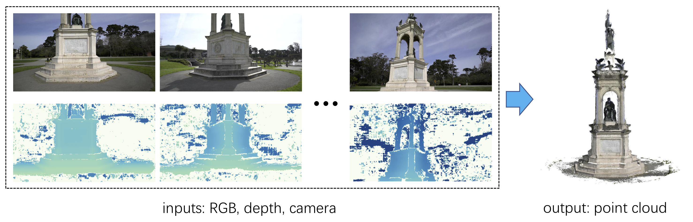

# Depth Fusion with Consistency Check




## Requirements

* python 3.6 (Anaconda)
* ``pip install -r requirements.txt``


## Consistency Check


## Usage
* In ``run.sh``, set ``root_path`` to the top directory, the organization is compatible with the outputs of [UCSNet](https://github.com/touristCheng/UCSNet). If you want to process your custom data, please modify the ``load_data`` function 
* Adjust ``prob_thresh``, ``dist_thresh`` and ``num_consist`` accordingly
* ``bash run.sh``


## Citing

This repository is a part of [UCSNet](https://github.com/touristCheng/UCSNet), the code will be available after the paper be accepted. If you find this project useful for your research, please cite: 

```
@inproceedings{cheng2020deep,
  title={Deep stereo using adaptive thin volume representation with uncertainty awareness},
  author={Cheng, Shuo and Xu, Zexiang and Zhu, Shilin and Li, Zhuwen and Li, Li Erran and Ramamoorthi, Ravi and Su, Hao},
  booktitle={Proceedings of the IEEE/CVF Conference on Computer Vision and Pattern Recognition},
  pages={2524--2534},
  year={2020}
}
```


