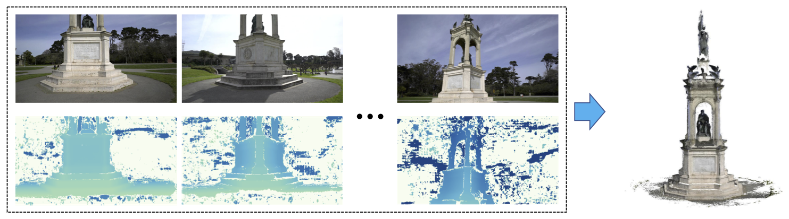
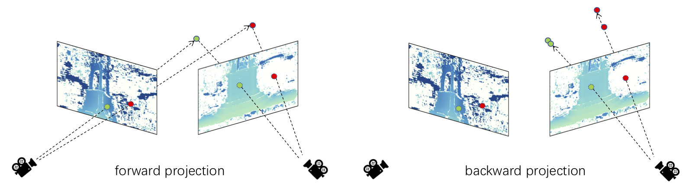

# Depth Fusion with Consistency Check




## Requirements


## Consistency Check




## Usage


## Citing

This repository is a part of [UCSNet](https://github.com/touristCheng/UCSNet), the code will be available after the paper be accepted. If you find this project useful for your research, please cite: 

```
@misc{1911.12012,
Author = {Shuo Cheng and Zexiang Xu and Shilin Zhu and Zhuwen Li and Li Erran Li and Ravi Ramamoorthi and Hao Su},
Title = {Deep Stereo using Adaptive Thin Volume Representation with Uncertainty Awareness},
Year = {2019},
Eprint = {arXiv:1911.12012},
}
```


